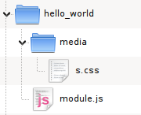

.. _guides-writing-plugins:

================
Writing plug-ins
================

.. warning::
    This document is valid for Mandoo 2.0.

To make our lives easier, Mandoo includes a nice *module engine* that basically loads scripts and styles to the page, saving some extra and repetitious markup.

Usage example:

.. code-block:: javascript

    u.require('hello_world', 'some_other_plugin');

Simple. We find it much better than adding extra markup (styles + scripts) to every page we work on - like other JavaScript libraries do.

This document will guide you in the very simple task of creating plug-ins (modules) for Mandoo.

============
Hello world!
============

File structure
==============

We do like the "convention over configuration" philosophy, so there is a convention on the file structure. You must follow this example:

If your plug-in is going to use styles and/or other static files, they go to the ``media`` folder. Otherwise, you don't need this directory at all; the plug-in is fine with just the ``module.js``.

The plug-in core
================

Time to learn how to make the magic.

The built-in ``u.Module`` constructor is our friend here; we will pass some parameters to it so our plug-in will be available in the page:

    * Some information about the plug-in
    * Functions to be added to the Mandoo **core**
    * Functions to be added to the Mandoo **collection methods** (optional)
    * An initializer function, for specific cases (optional)

See the example:

.. code-block:: javascript

    // import some dependencies
    u.require('some_other_plugin', 'another_dependency');

    new u.Module('hello_world',
    // some information about the plug-in (put whatever you want here, but keep 'version')
    { version: 0.1, author: "me" },

    {// The plug-in core. These stuff will be available in the ``u`` namespace.
        sayHello: function () {
            alert("Hello world!"); },

        sayHelloTo: function (name) {
            alert("Hello, " + name); }
    },

    {// Some additional functions to handle collections directly.
        sayHelloAndGoodbye: function () {
            alert("Saying hello to " + this.length + "elements!");
            this.fadeOut();
            alert("Goodbye, elements!"); }
    },

    // The optional initializer
    function () {
        // do something here
    });

This is our plug-in. You can see more (and functional) examples in the existent plug-ins.

From now on, Mandoo will have some new stuff available for use:

.. code-block:: javascript

    // added to the core:
    u.sayHello();
    u.sayHelloTo("Cindy");

    // added to the elements methods:
    u("div.some-class").sayHelloAndGoodbye();

Now you can put the code example above in your ``module.js`` and follow the file structure we showed above.

Styling
=======

At the time you import the plug-in in your script, Mandoo will look for a ``media/s.css`` file. If it exists, the CSS will be added to your page's ``<head>``.

.. tip::
    If your module will not use a stylesheet, add ``hasCSS: false`` to the module info. It will force Mandoo to don't look for any stylesheet file.

You can add images to the media folder and just call them in your ``s.css``. Here's an example, assuming you put the images in a ``media/pics`` directory:

.. code-block:: css

    .my-plugin-class {
        background-image: url("pics/my-image.png");
        color: #003;
    }

And that's all. Easy, huh? Tell us if you just developed your own plug-in and want it to be listed here. Other people may love your contribution. :D