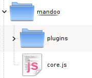

.. _intro-installation:

============
Installation
============

There is nothing else to do than adding a `
    </body>
    </html>

You might be used to insert script tags at your page's `<head>`, which is not a good practice:
    * it makes all your content (the most important part of your page) to wait for all the scripts to be loaded and executed first to be finally shown  (a **performance** failure).
    * it silly forces you to use one event (`DOMReady` or even `load`), otherwise the elements accessed by the scripts would not be loaded yet (a **programming** failure).

All your code may be in following new script tags, as you would do with any JavaScript library.

Plug-ins
========

You don't need any extra markup here. Really. Every Mandoo extra module is loaded in your JavaScript file through the :ref:`u.require`, so you don't have to touch every page you will use Mandoo extras on.
